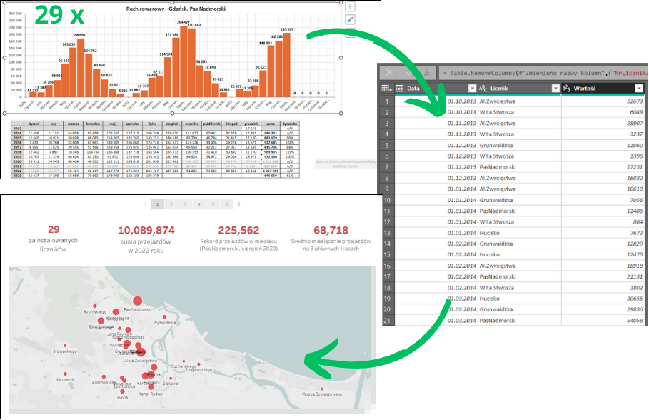
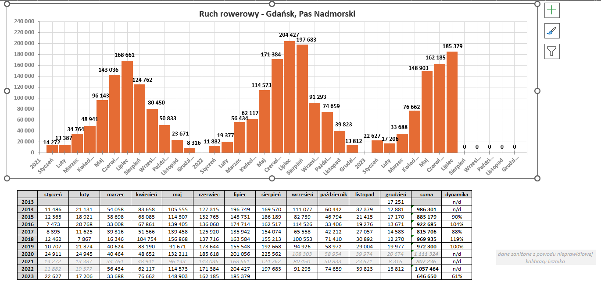
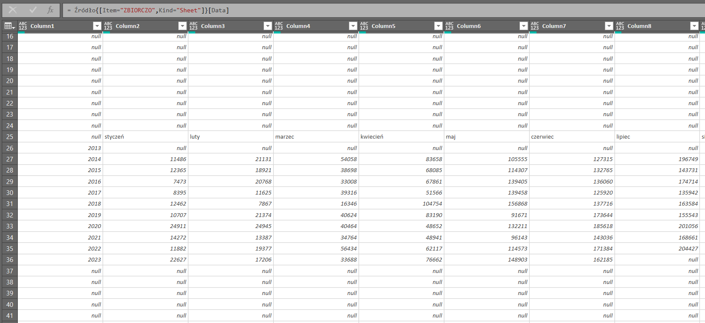
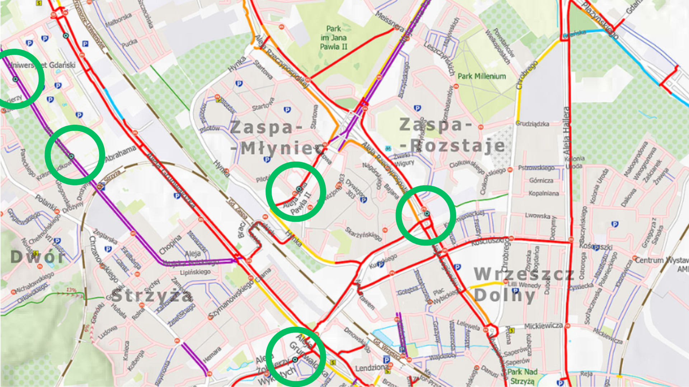
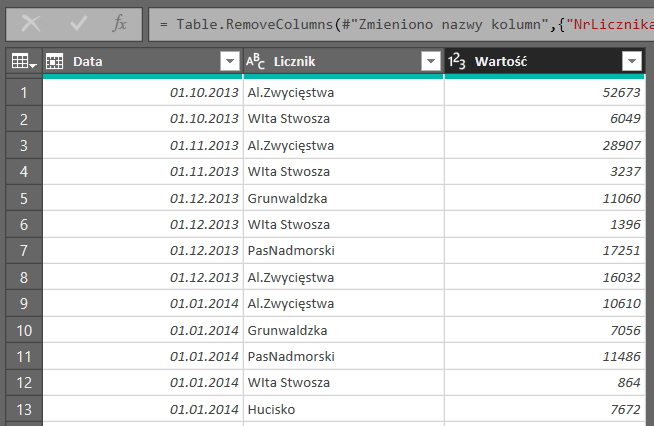
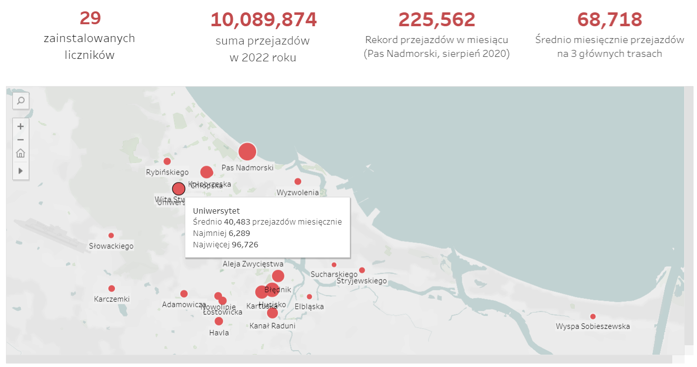
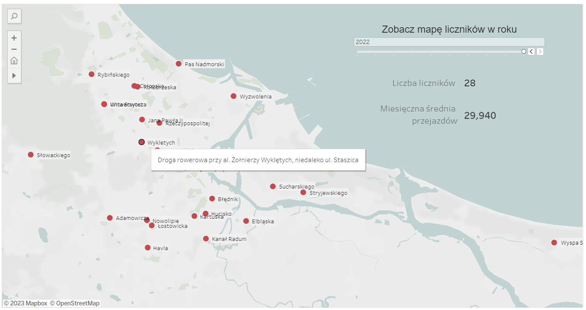
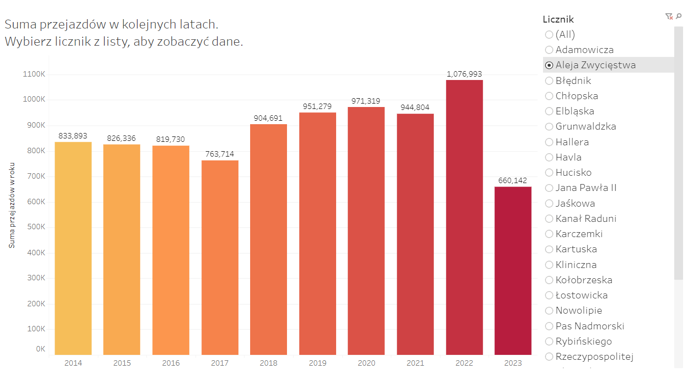
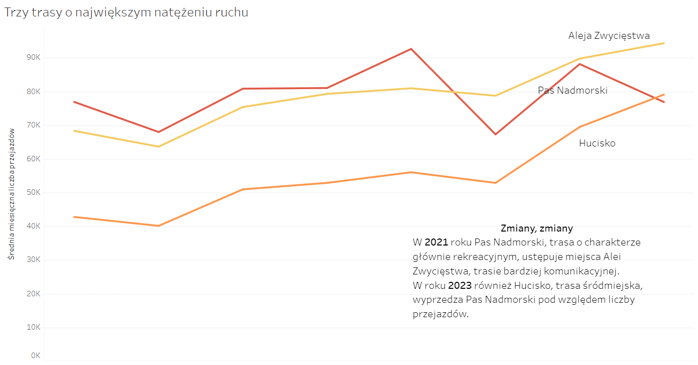
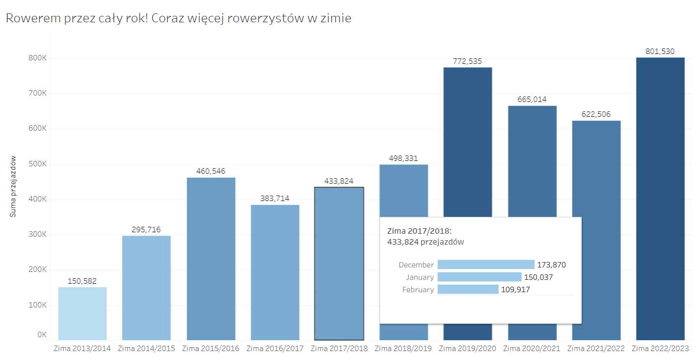

# Rowerowy Gdańsk - analiza danych z liczników rowerowych za lata 2013-2023

  
Zobacz raport na żywo: przejdź do [Tableau Public](https://public.tableau.com/app/profile/justyna5640/viz/RowerowyGdask2013-2023/RowerowyGdansk)
 
## SPIS TREŚCI
* [W skrócie](#w-skrócie)
* [Dane źródłowe](#1-dane-źródłowe)
* [Przygotowanie danych](#2-przygotowanie-danych)
* [Tableau Public](#3-tableau-public)
* [Plany na przyszłość](#4-plany-na-przyszłość)
  
# W skrócie
Projekt powstał "dla zabawy", w celu praktycznego wykorzystania umiejętności obsługi PowerQuery oraz Tableau Public. 
Użyte programy: Excel, PowerQuery, Tableau Public. 
Na chwilę obecną zakładam, że projekt był jednorazowy, nie wykluczam jednak późniejszych aktualizacji.

# 1. Dane źródłowe
## 1.1. Źródło danych dot. liczby przejazdów
W momencie tworzenia projektu (lipiec-sierpień 2023) w Gdańsku znajduje się 29 liczników rowerowych, które stopniowo pojawiały się w mieście od października 2013. 
Wszystkie dane dot. zarejestrowanych przejazdów są udostępniane publicznie na stronie [https://rowerowygdansk.pl/](https://rowerowygdansk.pl/pomiar-ruchu) w formie plików .xls.
  
Warto pamiętać, że zamontowane w drogach rowerowych czujniki zliczają jedynie przejazdy bez identyfikacji roweru, więc jeden rowerzysta w czasie jednego przejazdu mógł zostać uwzględniony przez kilka liczników. 
W raporcie wykorzystałam dane od października 2013 do lipca 2023.
  
Dla każdego licznika dostępny jest arkusz z tabelą danych za poszczególne miesiące i lata oraz prostym wykresem.
Dostępne są również dane za poszczególne dni, jednak z uwagi na wyjątkowo nieprzystępną formę ich publikacji postanowiłam skupić się na danych miesięcznych.
  

  
Część plików zaimportowałam do PowerQuery bezpośrednio ze strony internetowej. Niestety w przypadku znacznej części plików napotkałam niezidentyfikowany problem z pobieraniem przez PowerQuery nagłówków tabeli, co wymagało wstępnej edycji danych w Excelu. 
Po załadowaniu do PowerQuery tabela wygląda następująco:  

  

## 1.2. Brakujące / niepełne dane
Pas Nadmorski: z powodu nieprawidłowej kalibracji licznika dane za okres od września 2020 do lutego 2022 są zaniżone; 
Karczemki: transfer danych zawieszony za okres luty 2022 - czerwiec 2023; 
Żołnierzy Wyklętych: z powodu awarii brak danych za okres od czerwca do października; 
Stryjewskiego: 
- z powodu przebudowy ulicy brak danych za grudzień 2018 - wrzesień 2020,
- z powodu awarii licznika brak danych za okres od marca do czerwca 2023.

## 1.3. Źródło danych dot. lokalizacji liczników
Dane udostępniane przez miasto nie zawierają dokładnych współrzędnych liczników a jedynie jednozdaniowy opis. 
Liczniki są natomiast zaznaczone na rowerowej mapie Gdańska dostępnej [tutaj](https://rowerowygdansk.pl/mapa-rowerowa), co w połączeniu z Google Maps i trzema wolnymi wieczorami :) pozwoliło mi ręcznie zebrać współrzędne geograficzne o dokładności wystarczającej na stworzenie tego raportu.  
 

## 1.4. Dane pomocnicze
Na potrzeby analizy przejazdów w poszczególnych porach roku, stworzyłam również osobną tabelę przypisującą porę roku do konkretnych miesięcy, zgodnie z kalendarzem w naszej strefie klimatycznej (zima = grudzień-luty, wiosna = marzec-maj, itd.)

# 2. Przygotowanie danych
 
Jak widać na zamieszczonej wcześniej grafice, dane dot. liczby przejazdów zostały udostępnione w formie względnie wygodnej dla oka, ale niezdatnej do zbiorczej analizy wszystkich liczników.

## 2.1. Oczyszczanie danych
W celu otrzymania danych w formie zdatnej do analizy konieczne było m.in.:
1) Usunięcie pustych/niepotrzebnych kolumn i wierszy;
2) "Unpivot" w celu otrzymania danych w jednej kolumnie zamiast szerokiej tabeli;
4) Dodanie jednej kolumny z odpowiednio sformatowaną datą zamiast osobnych kolumn na rok i miesiąc;
6) Na końcu połączyłam dane dot. wszystkich liczników w jedną zbiorczą tabelę.
     
 

## 2.2. Automatyzacja pracy
Z uwagi na dużą ilość zapytań wymagających praktycznie identycznych czynności, pomocna okazała się opcja edytora zaawansowanego. Po ręcznym przygotowaniu pierwszego pliku z danymi mogłam skopiować odpowiedni fragment kodu w języku M i wkleić go do kolejnych zapytań. Z uwagi na to, że w różnych plikach tabele wstawiane były do różnych miejsc arkusza, pierwsze kroki musiałam każdorazowo wykonać ręcznie. Jednak możliwość łatwego ominięcia nadmiarowego "klikania" przy prawie 30 identycznych plikach oszczędziła mi sporo dużo czasu.
  

## 2.3. Samo życie
W tym momencie musiałam wziąć pod uwagę możliwości mojego komputera, któremu przetwarzanie dokumentu z tak dużą ilością zapytań zajmowało zbyt wiele czasu. Skopiowałam więc surowe wartości ze stworzonej w PowerQuery zbiorczej tabeli do nowego, pustego pliku, i pracowałam już tylko na nim.

# 3. Tableau Public
Do stworzenia raportu wybrałam Tableau Public, ponieważ umożliwia bezpłatne upublicznienie stworzonego raportu w formie interaktywnej.  
  
  
  
  
  

# 4. Plany na przyszłość
* stworzenie podobnego raportu z wykorzystaniem Power BI
* wykorzystanie narzędzi statystycznych do uzupełnienia raportu o brakujące dane (zaniżone z powodu nieprawidłowej kalibracji licznika lub brakujących z powodu remontów/awarii)
* być może również stworzenie raportu z wykorzystaniem danych dziennych zamiast miesięcznych  
Dziękuję za uwagę! :)
