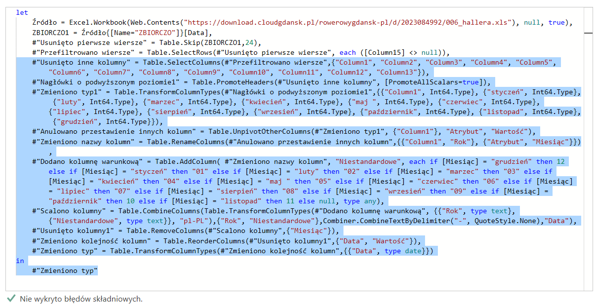

# Rowerowy Gdańsk - analiza danych z liczników rowerowych za lata 2013-2023

  
Zobacz raport na żywo: przejdź do [Tableau Public](https://public.tableau.com/app/profile/justyna5640/viz/RowerowyGdask2013-2023/RowerowyGdansk)
 
## SPIS TREŚCI
* [W skrócie](#w-skrócie)
* [Dane źródłowe](#1-dane-źródłowe)
* [Przygotowanie danych](#2-przygotowanie-danych)
* [Tableau Public](#3-tableau-public)
  
# W skrócie
Projekt powstał "dla zabawy", w celu praktycznego wykorzystania umiejętności obsługi PowerQuery oraz Tableau Public. 
Użyte programy: Excel, PowerQuery, Tableau Public. 
Na chwilę obecną zakładam, że projekt był jednorazowy, nie wykluczam jednak późniejszych aktualizacji.

# 1. Dane źródłowe
## 1.1. Źródło danych dot. liczby przejazdów
W momencie tworzenia projektu (lipiec-sierpień 2023) w Gdańsku znajduje się 29 liczników rowerowych, które stopniowo pojawiały się w mieście od października 2013. 
Wszystkie dane dot. zarejestrowanych przejazdów są udostępniane publicznie na stronie [https://rowerowygdansk.pl/](https://rowerowygdansk.pl/pomiar-ruchu) w formie plików .xls zawierających dzienne i miesięczne statystyki od momentu instalacji licznika.
 
Część plików zaimportowałam do PowerQuery bezpośrednio ze strony internetowej. Niestety w przypadku znacznej części plików napotkałam niezidentyfikowany problem z pobieraniem przez PowerQuery nagłówków tabeli, co wymagało wstępnej edycji danych w Excelu. 
  
Dla każdego licznika dostępny jest arkusz z tabelą danych za poszczególne miesiące i lata oraz prostym wykresem.
Dostępne są również dane za poszczególne dni, jednak z uwagi na wyjątkowo nieprzystępną formę ich publikacji postanowiłam skupić się na danych miesięcznych.
  

  
Po załadowaniu do PowerQuery tabela wygląda następująco: 

  

## 1.2. Źródło danych dot. lokalizacji liczników
Dane udostępniane przez miasto nie zawierają dokładnych współrzędnych liczników a jedynie jednozdaniowy opis. 
Liczniki są natomiast zaznaczone na rowerowej mapie Gdańska dostępnej [tutaj](https://rowerowygdansk.pl/mapa-rowerowa), co w połączeniu z Google Maps i trzema wolnymi wieczorami :) pozwoliło mi ręcznie zebrać współrzędne geograficzne o dokładności wystarczającej na stworzenie tego raportu.

## 1.3. Dane pomocnicze
Na potrzeby analizy przejazdów w poszczególnych porach roku, stworzyłam również osobną tabelę przypisującą porę roku do konkretnych miesięcy, zgodnie z kalendarzem w naszej strefie klimatycznej (zima = grudzień-luty, wiosna = marzec-maj, itd.)

# 2. Przygotowanie danych
 
Jak widać na zamieszczonej wcześniej grafice, dane dot. liczby przejazdów zostały udostępnione w formie względnie wygodnej dla oka, ale niezdatnej do zbiorczej analizy wszystkich liczników.

## 2.1. Oczyszczanie danych
W celu otrzymania danych w formie zdatnej do analizy konieczne było m.in.:
1) Usunięcie pustych/niepotrzebnych kolumn i wierszy.  W poszczególnych plikach tabele ładowane były do różnych komórek i wierszy, stąd pierwsze kroki w każdym z zapytań musiałam przygotować ręcznie.
2) "Unpivot" w celu otrzymania danych w jednej kolumnie zamiast szerokiej tabeli
4) Dodanie jednej kolumny z odpowiednio sformatowaną datą zamiast osobnych kolumn na rok i miesiąc.
6) Na końcu połączyłam dane dot. wszystkich liczników w jedną zbiorczą tabelę.

## 2.2. Automatyzacja pracy
Z uwagi na dużą ilość zapytań wymagających praktycznie identycznych czynności pomocna okazała się opcja edytora zaawansowanego. Po wykonaniu pierwszych kroków 

Przy prawie 30 praktycznie identycznych plikach była to znaczna oszczędność czasu.

## 1.3. Samo życie
W tym momencie musiałam wziąć pod uwagę możliwości mojego komputera, któremu przetwarzanie dokumentu z tak dużą ilością zapytań zajmowało zbyt wiele czasu. Skopiowałam więc surowe wartości ze stworzonej w PowerQuery zbiorczej tabeli do nowego, pustego pliku, i pracowałam już tylko na nim.

# 3. Tableau Public
Do stworzenia raportu wybrałam Tableau Public, ponieważ narzędzie to umożliwia bezpłatne upublicznienie stworzonego raportu w formie interaktywnej.
